<div align="center">



<br><br>

<a href="https://gabrielggc18.github.io/Gabriel-de--Sa-Mendes/"></a>
<a href="https://www.linkedin.com/in/gabriel-de-s%C3%A1-640314211/"></a>
<a href="https://www.instagram.com/gabrieldsa_mendes/"></a>

</div>

## Sobre mim

Olá! Me chamo **Gabriel** e sou **desenvolvedor full stack**, com foco em arquitetura de software, APIs REST, integração de sistemas e automações. Trabalho com **Python (Django / FastAPI)**, **JavaScript / TypeScript**, **React** e **PostgreSQL**.

Gosto de transformar processo manual em sistema e de estudar o que ainda não sei.

```python
class Gabriel:
    base     = "Palmas, Tocantins 🇧🇷"
    cargo    = "Desenvolvedor Full Stack · Estagiário na Prefeitura de Palmas"
    foco     = "Arquitetura de software, integrações e automações"
    agora    = "Construindo o ATOM, meu agente pessoal de IA"
    lema     = "Do conceito ao deploy."
```

## Stack

<div align="center">

<table>
  <tr>
    <td align="right"><sub><b>BACK-END</b></sub></td>
    <td>
      
      
      
      
      
      
    </td>
  </tr>
  <tr>
    <td align="right"><sub><b>FRONT-END</b></sub></td>
    <td>
      
      
      
      
      
    </td>
  </tr>
  <tr>
    <td align="right"><sub><b>DADOS</b></sub></td>
    <td>
      
      
      
    </td>
  </tr>
  <tr>
    <td align="right"><sub><b>DEVOPS E FERRAMENTAS</b></sub></td>
    <td>
      
      
      
      
      
    </td>
  </tr>
</table>

</div>

## Projetos em destaque

| Projeto | Descrição | Stack |
| --- | --- | --- |
| [**GSM Startup**](https://gsm-startup.vercel.app/) | Startup de tecnologia focada em SaaS, AgroTech, automação e marketing digital. Do campo ao digital. | Django, React |
| **Mídia 63** | Portal de notícias em produção: publicação editorial, área administrativa, integrações e deploy em VPS. | Django, PostgreSQL, Nginx |
| [**ATOM**](https://github.com/GabrielGGC18/Atom-) | Agente pessoal de IA que orquestra sub-agentes e skills, com memória persistente e roteamento de tarefas. | Python, IA |
| [**Force Up Fit**](https://gabrielggc18.github.io/Force-up-Fit-new/) | Aplicação voltada para treinos e condicionamento físico. | HTML, CSS, JavaScript |
| [**FastAPI**](https://github.com/GabrielGGC18/FastAPI) | APIs REST com rotas assíncronas, Pydantic, versionamento e boas práticas de arquitetura. | Python, FastAPI |
| [**Portfólio**](https://github.com/GabrielGGC18/Gabriel-de--Sa-Mendes) | Este repositório: meu site autoral, vitrine dos meus projetos. | HTML, CSS, JavaScript |

## Números

<div align="center">


</div>

## Contribuições em 3D

<div align="center">

<!-- Gerado diariamente por .github/workflows/profile-3d.yml -->


<!-- Gerado a cada 12h por .github/workflows/snake.yml -->
<picture>
  <source media="(prefers-color-scheme: dark)" srcset="assets/readme/snake-dark.svg">
  
</picture>

</div>
